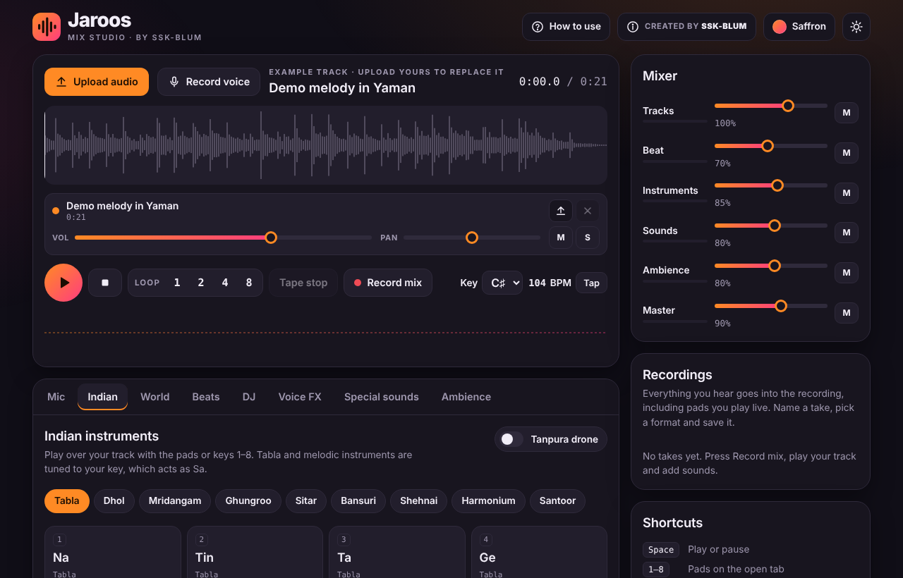
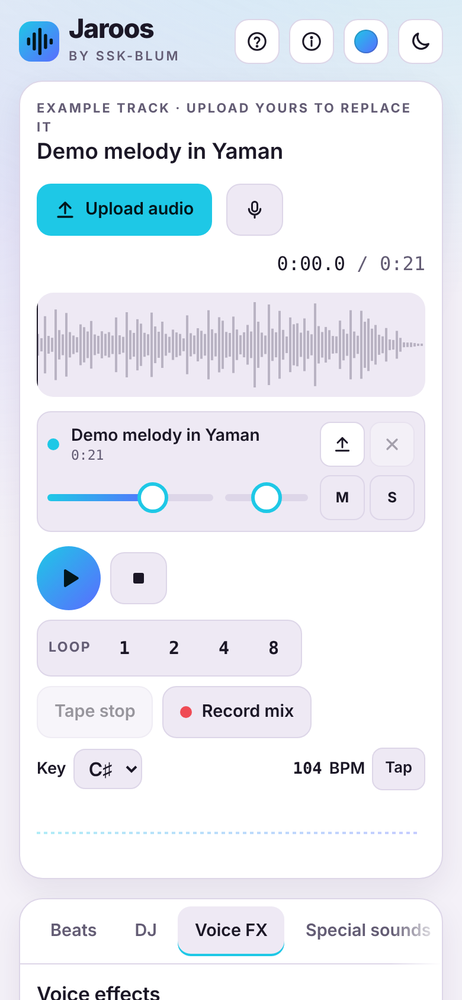
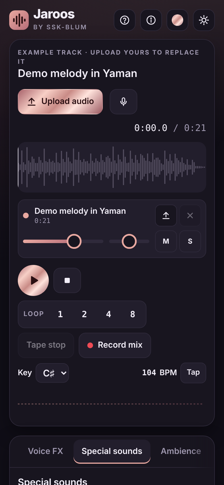

# Jaroos — Mix Studio

**Turn a voice note, speech or song into a finished mix, right in your browser.**
Upload or record up to three tracks, then add backing beats, Indian and world instruments, DJ and voice effects, special sounds and ambience. Record the result and save or share it.

Created by **SSK-BLUM**.




<p align="center">
  
  
</p>

## Features

**Tracks and recording**
- Up to 3 tracks played in sync, each with volume, pan, mute, solo, replace and remove
- Upload MP3, WAV, M4A, OGG/Opus voice notes or video soundtracks, or drag several files onto the deck
- Mic voice recorder with count-in and record-over-your-music
  - Noise cancellation: browser noise suppression, echo cancellation and auto gain, plus spectral noise reduction, noise gate and rumble cut
  - Tone: warmth, presence, leveler and normalize
  - Tuning: pitch shift (±12 semitones) and auto-tune to your key, a scale or a raga
- Record the whole mix, name each take, save it as WebM/M4A or WAV, or share it from your phone

**Music**
- 20 background beats in any key, 50–170 BPM
  - Slow: Ballad, Ghazal, Slow jam, Ambient, Reggae, Lo-fi
  - Medium: Qawwali, Hip-hop, Reggaeton, Arabic maqsum, Khaleeji, Bhangra, Bollywood, Afrobeat, Pop
  - Fast: Garba, House, Techno, Trap, Drum & bass
- Indian instruments: tabla, dhol, mridangam, ghungroo, sitar, bansuri, shehnai, harmonium, santoor, tanpura drone; 6 ragas with sargam labels
- World instruments: darbuka, djembe, taiko, cajón, steel pan, kalimba, koto, marimba, oud, didgeridoo drone; 6 scales
- 12 ambience loops: rain, thunderstorm, wind, desert wind, ocean waves, river stream, forest birds, night crickets, campfire, café, city street, temple courtyard

**Effects**
- DJ: crossfader, master filter, 3-band EQ with kills, tempo-synced echo, reverb, presets, beat loops, tape stop, tap tempo
- 22 voice effects with amount and wobble speed: telephone, old radio, walkie-talkie, megaphone, old record, robot, alien, monster, chipmunk, deep voice, ghost, 8-bit, underwater, stadium, cathedral, choir, jet flanger, phaser, vibrato, tremolo, auto-wah
- 26 special sounds: air horn, scratch, laser, dub siren, riser, boom drop, sub drop, cymbal crash, drum roll, applause, thunder, gong, temple bell, shankh, damaru, manjira and more
- Mixer with level meters and mutes for tracks, beat, instruments, sounds, ambience and master

**App**
- Dark and light mode; 6 colours and 6 metallic finishes (gold, silver, bronze, rose gold, copper, titanium)
- Built for phones: sticky mini player, large touch targets, haptics on Android, screen stays awake while playing
- Installable and works offline after the first visit
- How-to-use guide on first visit, plus keyboard shortcuts

## Run it locally

No build step and no dependencies. Serve the folder with any static server:

```bash
git clone https://github.com/<your-username>/jaroos.git
cd jaroos
python3 -m http.server 8080
# open http://localhost:8080
```

The microphone, service worker and app install need **HTTPS or localhost**, so opening `index.html` directly from disk will not enable them.

## Publish on GitHub Pages

This repository includes a workflow (`.github/workflows/deploy-pages.yml`) that publishes the site on every push to `main`.

1. Push the repository to GitHub.
2. Go to **Settings → Pages** and set **Source** to **GitHub Actions**.
3. Push to `main`, or run the workflow from the **Actions** tab.
4. Your app is live at `https://<your-username>.github.io/jaroos/`.

Prefer no workflow? Set **Source** to **Deploy from a branch**, pick `main` and `/ (root)`.

## Install as an app

- **Android / Chrome / Edge:** open the site and tap **Install app** in the top bar, or use the browser menu.
- **iPhone / iPad:** open the site in Safari, tap **Share → Add to Home Screen**.

## Keyboard shortcuts

| Key | Action |
| --- | --- |
| Space | Play or pause |
| 1–8 | Pads on the open Indian or World tab |
| 1–0, -, =, Q–G | Special sounds |
| L | Loop 4 beats on or off |
| R | Start or stop recording the mix |
| ? | Open the how-to guide |

## Project structure

```
index.html             The whole app: HTML, CSS and JavaScript
manifest.webmanifest   App name, colours, icons and screenshots for installing
sw.js                  Service worker: offline cache for the app and fonts
icons/                 App icons, including a maskable icon for Android
screenshots/           Images used in this README and the install dialog
.github/workflows/     GitHub Pages deployment
```

## How it works

Every sound is synthesised live with the Web Audio API: drums, bass and pads, the Karplus-Strong strings behind the sitar, koto and tanpura, and the noise-based ambiences. There are no audio sample files. Uploads and recordings are processed on your device and never leave it. Mic clean-up (spectral noise reduction, gate, pitch shift and auto-tune) runs in JavaScript, followed by an offline render for EQ and compression.

## Browser support

Recent Chrome, Edge, Firefox and Safari on desktop and mobile. On iPhone, the app plays even with the silent switch on (iOS 16.4 and later).

## Credits

Designed and created by **SSK-BLUM**.

## License

[MIT](LICENSE) © 2026 SSK-BLUM
